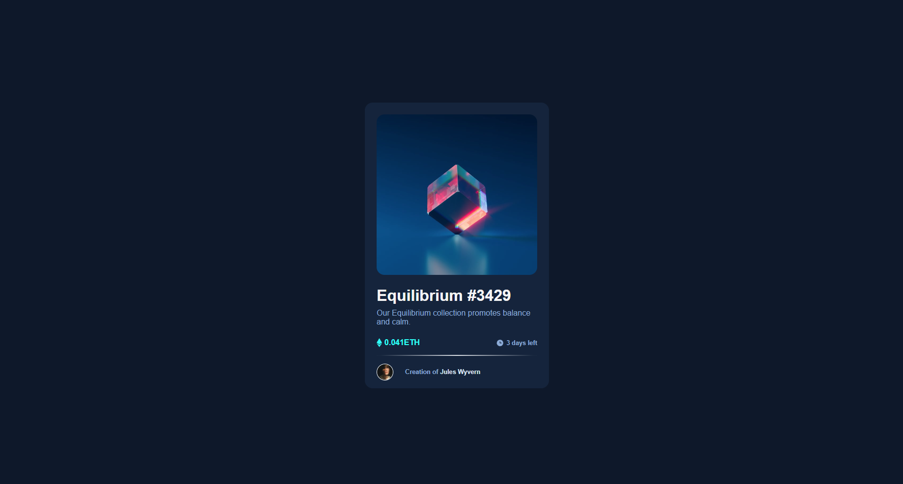
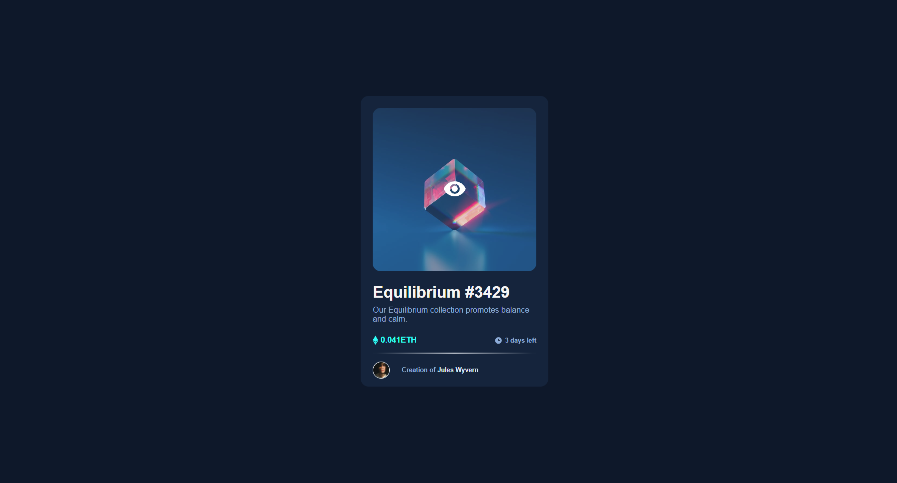
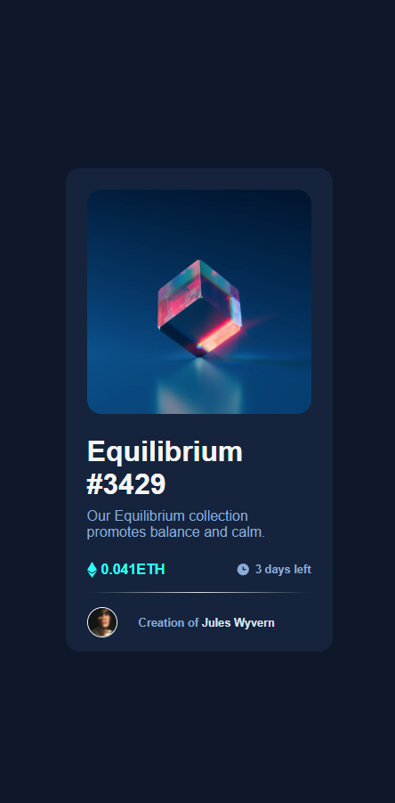

# Frontend Mentor - My solution to NFT preview card component

This is my solution to the [NFT preview card component challenge on Frontend Mentor](https://www.frontendmentor.io/challenges/nft-preview-card-component-SbdUL_w0U). Frontend Mentor challenges help you improve your coding skills by building realistic projects.

## Table of contents

- [Overview](#overview)
  - [The challenge](#the-challenge)
  - [Screenshot](#screenshot)
  - [Links](#links)
- [My process](#my-process)
  - [Built with](#built-with)
  - [What I learned](#what-i-learned)
- [Author](#author)

## Overview

### The challenge

Users should be able to:

- View the optimal layout depending on their device's screen size
- See hover states for interactive elements

### Screenshot





### Links

- Solution URL: [Add solution URL here](https://github.com/mrintoxx/NFTCard)
- Live Site URL: [Add live site URL here](https://mrintoxx.github.io/NFTCard/)

## My process

### Built with

- Semantic HTML5 markup
- CSS custom properties
- Flexbox

### What I learned

It's a great exercice to understand relative and absolute positions.
Was the first time using an hidden item, next time should try more complex animations.

```css
.hidden {
  position: absolute;
  top: 0;
  left: 0;
  width: 100%;
  height: 100%;
  border-radius: 1rem;
  background-color: hsla(215, 51%, 70%, 0.2);
  display: flex;
  justify-content: center;
  align-items: center;
  opacity: 0;
  transition: all 0.3s ease-in 0s;
}
```

## Author

- Website - [@Mrintoxx's github] (https://github.com/mrintoxx)
- Frontend Mentor - [@Mrintoxx](https://www.frontendmentor.io/profile/mrintoxx)
